# 👋 Hi, I’m @AlyKazani04

I am a 3rd year Comp-Sci student at FAST-NUCES, Karachi. I love learning new things and tinkering with stuff. When I'm not learning a new language/framework/concept or setting up local Docker container networks, I'm probably tweaking my system configurations or reading a [murim](https://www.google.com/search?q=Murim) [manhwa](https://www.google.com/search?q=Manhwa).

- 👀 **Interests:** Backend Development & reading manhwas.
- 🌱 **Currently Learning:** New Backend concepts from random places, CSS Fundamentals.
- 📫 **Reach me:** [aly.kazani52@gmail.com](mailto:aly.kazani52@gmail.com) | [LinkedIn](https://www.linkedin.com/in/aly-kazani/) | [X (formerly Twitter)](https://x.com/f4ll3ndev)
- ⚡ **Fun fact:** My favorite music artist is EVE.

### 🔗 Socials & Links

<!--  -->

---

### 💻️ Currently Developing

  

---

### 🛠️ Technical Skills

### Languages

  
  
  
  
  

### Frameworks and Tools

  
  
  
  
  
  
  
  

### Databases

  
  
  <!--  -->

### OS & Environment

  
  
  
  

## 📊 Stats

  
  

  

