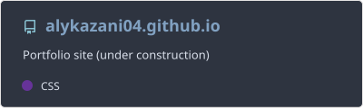
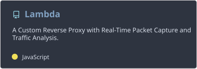
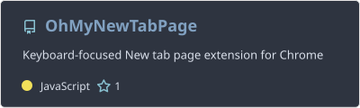
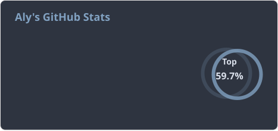
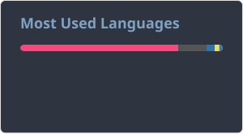

# 👋 Hi, I’m @AlyKazani04

I build backend services in Node.js and TypeScript — REST APIs, Postgres schemas, and containerized dev environments. When I'm not learning a new language/framework/concept or setting up local Docker container networks, I'm probably tweaking my system configurations or reading a [murim](https://www.google.com/search?q=Murim) [manhwa](https://www.google.com/search?q=Manhwa).

- 👀 **Interests:** Backend Development & reading manhwas.
- 🌱 **Currently Learning:** Reading **Designing Data Intensive Applications**
- 📫 **Reach me:** [aly.kazani52@gmail.com](mailto:aly.kazani52@gmail.com) | [LinkedIn](https://www.linkedin.com/in/aly-kazani/) | [X (formerly Twitter)](https://x.com/f4ll3ndev)
- ⚡ **Fun fact:** My favorite music artist is EVE.

### 🔗 Socials & Links

<!--  -->

---

### 💻️ Currently Developing

<!-- Each card below needs THREE matching pieces, or it silently won't show up:
     1. a "Generate ... pin card" step in .github/workflows/generate-repo-cards.yml
     2. the matching SVG at profile/<name>-repo.svg
     3. the <a href> +  pair right here
     To pause a project, comment out both (1) and (3). Leave the SVG on disk. -->

<!-- PAUSED: portfolio site — work on hold. Uncomment to bring the card back.

  

-->

  
  

---

### 🛠️ What I build with

| Stack                               | Where it's used                                                   |
| :---------------------------------- | :---------------------------------------------------------------- |
| Node.js, Express, TypeScript        | Lambda — L7/L4 reverse proxy, packet capture                      |
| PostgreSQL, Prisma ORM              | NoteStack — normalized schema on Neon                             |
| Docker Compose, Redis               | Lambda — multi-service dev env, capped event log                  |
| Python, PyTorch-adjacent ML tooling | AI Resume Analyzer — local embeddings via Ollama                  |
| React, TypeScript                   | Working knowledge — studied hooks and internals, not shipped solo |

#### Backend is where I'm strongest; frontend I'm actively building up

## 📊 Stats

  
  

  <!--  -->
  

